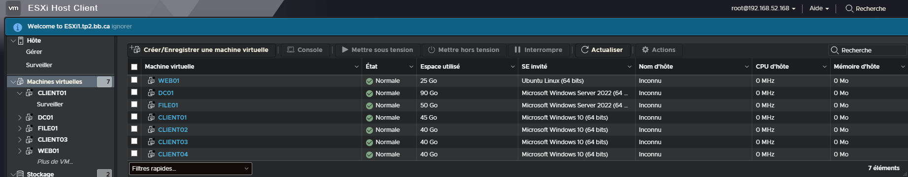
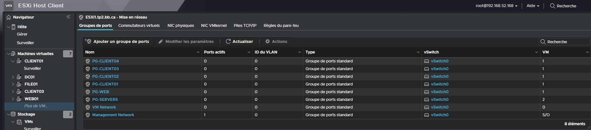
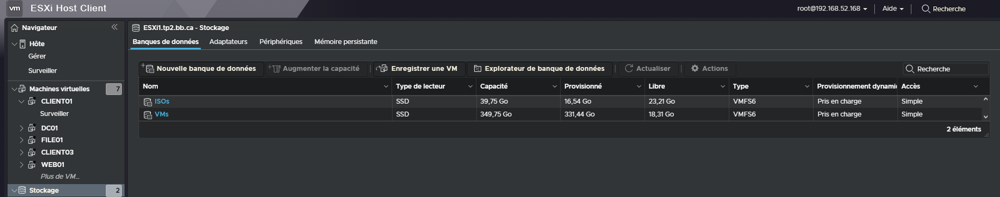
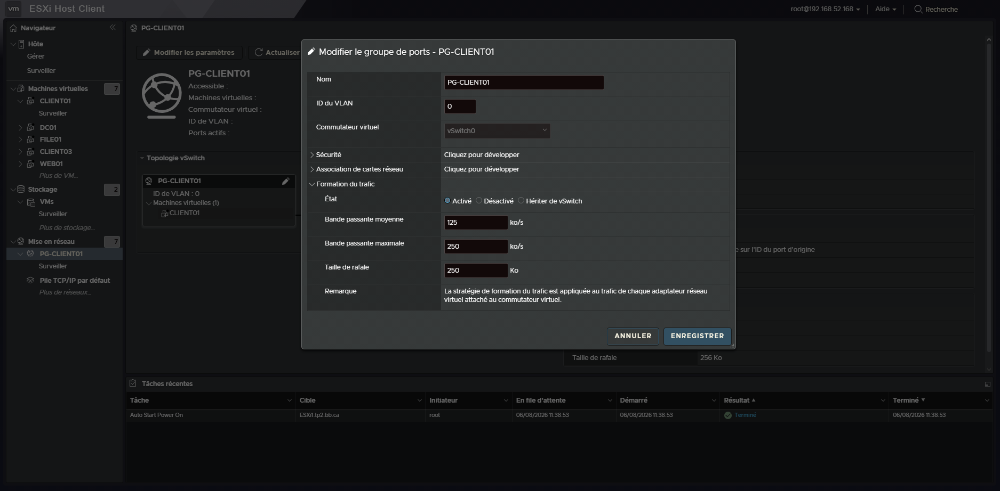

# Documentation de l'Architecture Réseau - TP2

## 1. Vue d'ensemble des Machines Virtuelles
Voici l'inventaire de nos machines virtuelles déployées sur l'infrastructure ESXi :

## 2. Segmentation Réseau (Groupes de ports)
Les groupes de ports virtuels ont été configurés pour isoler les services et les clients :

## 3. Gestion du Stockage
Aperçu des datastores configurés sur les hôtes :

## 4. Politiques de trafic (Limitations)

