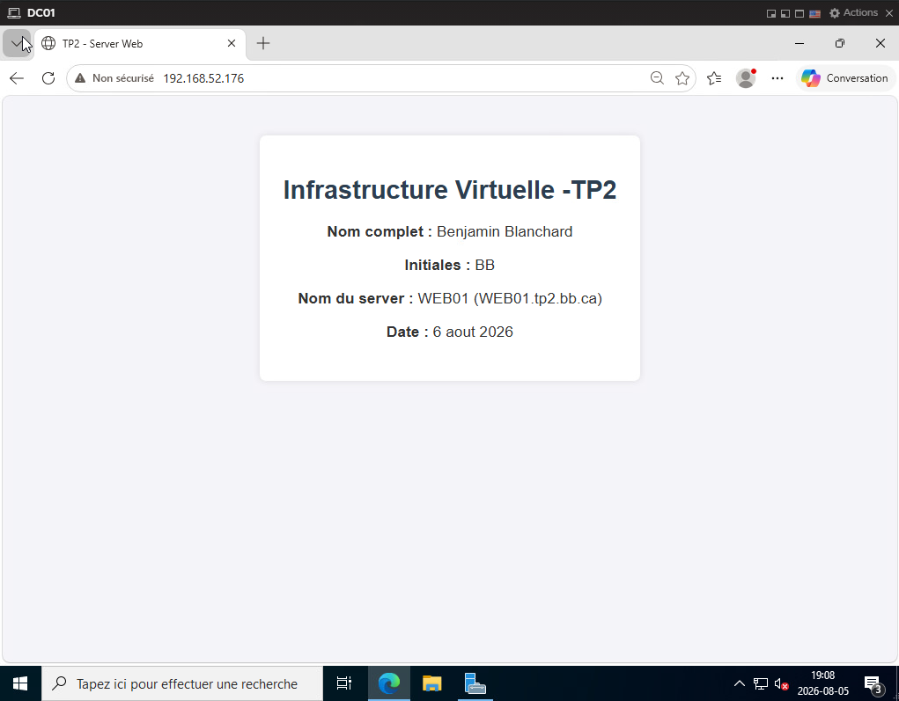

<!DOCTYPE html>
<html lang="fr">
<head>
    <meta charset="UTF-8">
    <title>TP2 - Server Web</title>
    
</head>
<body>
    

        <h1>Infrastructure Virtuelle -TP2</h1>
        
<strong>Nom complet :</strong> Benjamin Blanchard

        
<strong>Initiales :</strong> BB

        
<strong>Nom du server :</strong> WEB01 (WEB01.tp2.bb.ca)

        
<strong>Date :</strong> 5 août 2026

    

</body>
</html>

