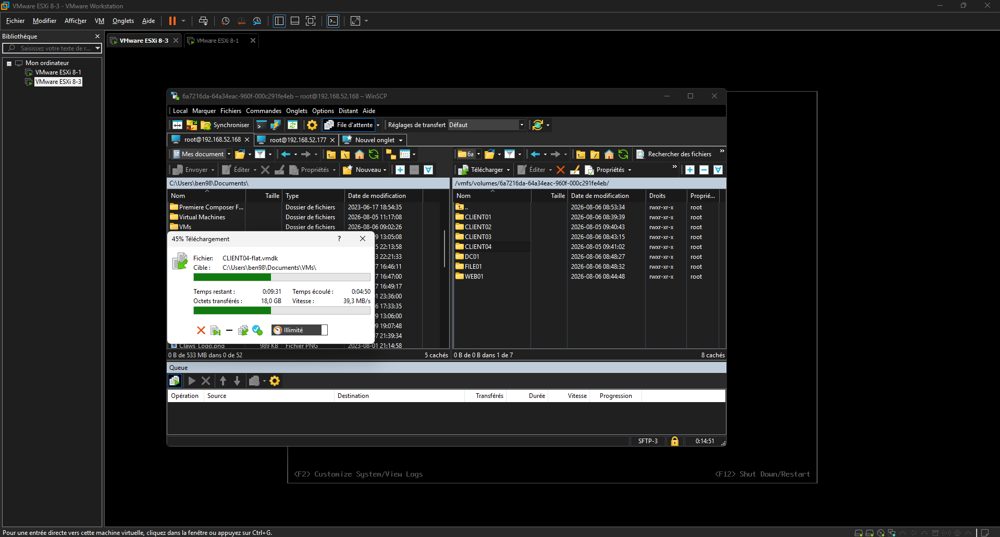

# Phase de Tests et Validation - Migration de CLIENT04

Cette section documente les tests de migration de la machine virtuelle `CLIENT04` de l'hôte source `esxi1` vers l'hôte de destination `esxi2`.

## 1. Méthode de Migration (WinSCP)
* **Étape 1 :** Arrêt propre de la machine virtuelle `CLIENT04` sur `esxi1`.
* **Étape 2 :** Connexion simultanée aux deux serveurs ESXi via **WinSCP** pour copier le dossier complet de la VM du datastore de `esxi1` vers celui de `esxi2` (transfert direct sans passer par le poste de travail local).
* **Étape 3 :** Sur l'interface d'administration de l'hôte `esxi2`, utilisation de l'explorateur de datastore pour faire un clic droit sur le fichier **`CLIENT04.vmx`** et sélectionner **Enregistrer la machine virtuelle (Register VM)**.
* **Étape 4 :** Rattachement de la machine au bon groupe de ports (`PG-CLIENT04`) recréé à l'identique sur `esxi2` et démarrage de la VM.

## 2. Résultats et Observations
* **Fonctionnement général :** La machine a démarré sans encombre et les services réseau ainsi que la communication avec le domaine se sont comportés de manière identique à l'état initial sur `esxi1`.
* **Anomalie constatée :** Un comportement mineur a été observé au premier lancement : l'icône de l'Explorateur de fichiers dans la barre des tâches ne répondait pas directement aux clics, mais l'application pouvait s'ouvrir sans problème via la barre de recherche Windows.

## 3. Captures d'écran de validation

